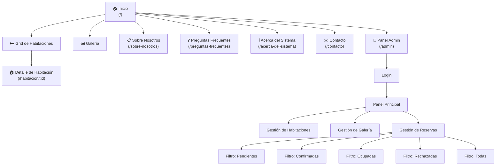
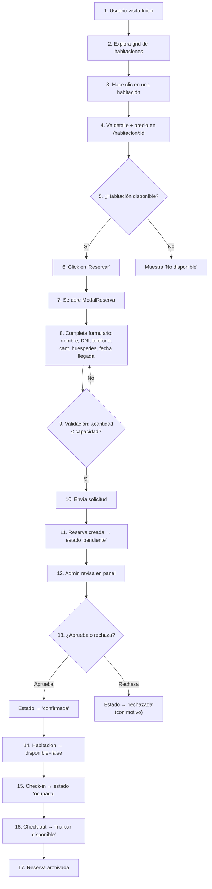

# Arquitectura de la Información

## Mapa del Sitio (Sitemap)

Diagrama jerárquico de la estructura de navegación del sitio:

### Descripción del Sitemap

| Sección | Ruta | Descripción |
|---|---|---|
| Inicio | `/` | Página principal con hero, grid de habitaciones y galería |
| Detalle de Habitación | `/habitacion/:id` | Información completa de una habitación y formulario de reserva |
| Sobre Nosotros | `/sobre-nosotros` | Información del hospedaje y su ubicación |
| Preguntas Frecuentes | `/preguntas-frecuentes` | FAQ con acordeón de preguntas y respuestas |
| Acerca del Sistema | `/acerca-del-sistema` | Detalles técnicos del proyecto y del desarrollador |
| Galería | `/galeria` | Grid completo de imágenes con modal de vista previa |
| Contacto | `/contacto` | Formulario de contacto para consultas |
| Admin | `/admin` | Panel protegido para gestión de habitaciones, galería y reservas |

---

## Flujo de Usuario (User Flow) — Proceso de Reserva

### Diagrama del flujo completo:

### Descripción textual del flujo

1. **Exploración:** El usuario llega al inicio del sitio y navega el grid de habitaciones.
2. **Selección:** Hace clic en la card de una habitación y es redirigido a `/habitacion/:id`.
3. **Decisión:** Visualiza la información detallada: imagen principal, descripción, lista de servicios con tags y precio calculado según capacidad ($15.000 × capacidad).
4. **Reserva:** Si la habitación está disponible, hace clic en el botón "Reservar", lo que abre un modal superpuesto.
5. **Formulario:** Completa los campos obligatorios: nombre completo, DNI, teléfono de contacto, cantidad de huéspedes y fecha de llegada.
6. **Validación en frontend:** El sistema verifica que la cantidad de huéspedes no exceda la capacidad máxima de la habitación antes de habilitar el envío.
7. **Envío:** Al enviar, los datos se insertan en la tabla `reservas` de Supabase con estado `pendiente`.
8. **Gestión administrativa:** El administrador ingresa al panel (`/admin`), revisa las reservas en la pestaña "Pendientes" y decide aprobar o rechazar cada una.
9. **Aprobación:** Al aprobar, la reserva pasa a `confirmada` y la habitación se marca automáticamente como no disponible (`disponible = false`).
10. **Ocupación:** Cuando el huésped llega, el admin cambia el estado a `ocupada`.
11. **Finalización:** Al realizar el check-out, el admin hace clic en "Marcar disponible", lo que libera la habitación y cambia la reserva a `rechazada` con motivo "Estadía finalizada".

---

> Anterior: [Planificación](01-planificacion.md) | Siguiente: [Wireframes](03-wireframes.md) | Volver al [README](../README.md)
