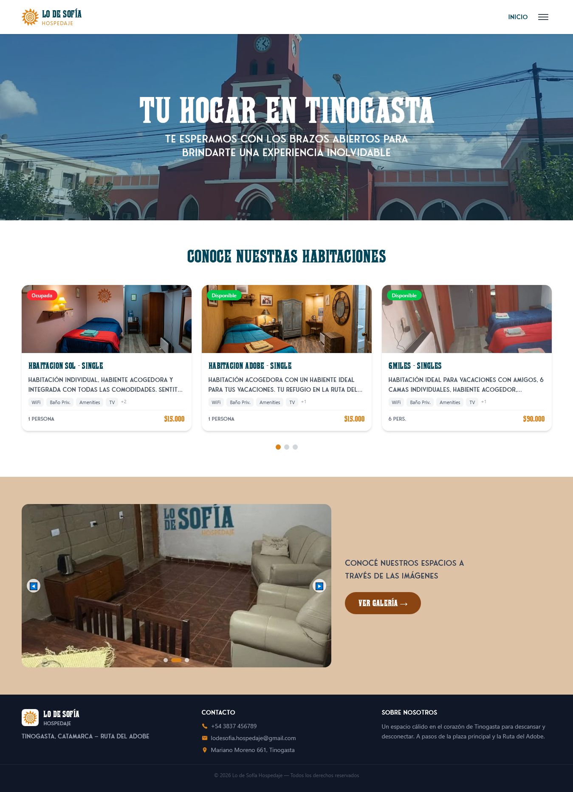
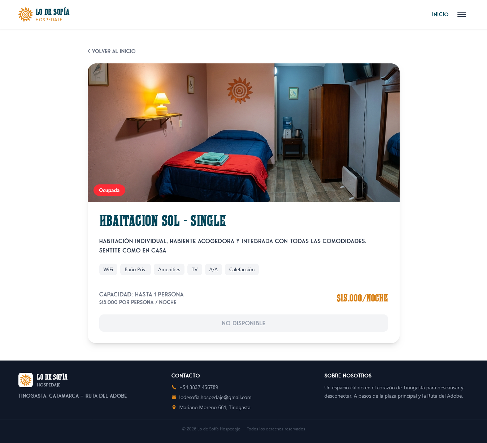
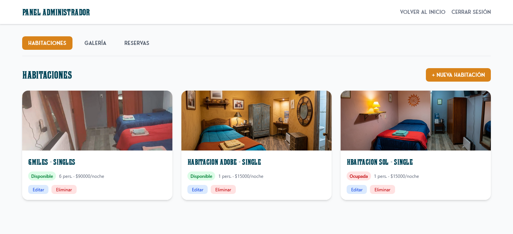

# Wireframes

Esta sección contiene los wireframes de baja fidelidad de las pantallas principales del sitio. Se utilizan capturas de pantalla del sitio en producción como representación visual.

> **Nota:** Las imágenes deben agregarse en la carpeta `docs/wireframes/`. Tomar capturas del sitio desplegado en [https://lo-de-sofia.netlify.app/](https://lo-de-sofia.netlify.app/) y guardarlas con los nombres indicados.

---

## Pantalla 1 — Inicio (`/`)

| Elemento | Descripción |
|---|---|
| **Navbar** | Logo a la izquierda, menú de navegación con hamburguesa en mobile. Links a Inicio, Sobre Nosotros, Preguntas Frecuentes, Acerca del Sistema, Galería, Contacto. Si el admin está logueado, muestra "Panel Admin". |
| **Hero** | Imagen de fondo (`hero-tinogasta.webp`) con overlay azul `#034659` al 40%. Eslogan "TU HOGAR EN TINOGASTA" en Farley MF blanco y subtítulo "Te esperamos con los brazos abiertos". Ocupa el 70% del alto de la pantalla. |
| **Grid de habitaciones** | 3 columnas en desktop, 1 columna en mobile. Cada card muestra: imagen, nombre, descripción breve, servicios como tags y precio calculado ($15.000 × capacidad). Badge verde "Disponible" o rojo "Ocupada". |
| **Pelotitas indicadoras** | Círculos debajo del grid (uno por habitación). La primera se muestra en color naranja como indicador visual. |
| **Galería** | Sección con fondo color arena `#DDC2A5`. Flyer automático de imágenes cada 4 segundos con flechas de navegación y dots indicadores. Botón "Ver Galería →" que navega a `/galeria`. |
| **Footer** | 3 columnas: (1) logo + nombre del hospedaje, (2) datos de contacto con íconos (teléfono, email, ubicación), (3) descripción breve de "Sobre nosotros". |

**Wireframe:**

---

## Pantalla 2 — Detalle de Habitación (`/habitacion/:id`)

| Elemento | Descripción |
|---|---|
| **Imagen** | Imagen grande de la habitación ocupando el ancho disponible. |
| **Información** | Nombre de la habitación en título Farley MF, descripción completa, lista de servicios con tags estilizados, precio calculado: "$XX.XXX por noche" (según capacidad). |
| **Badge de estado** | Verde "Disponible" o rojo "No disponible / Ocupada". |
| **Acción** | Si está disponible: botón naranja "Reservar" que abre el modal de reserva. Si está ocupada: mensaje "No disponible" sin botón. |
| **Modal de reserva** | Formulario superpuesto con campos: nombre, DNI, teléfono, cantidad de huéspedes (selector numérico), fecha de llegada (input date) y botón "Enviar solicitud". Validación en frontend: cantidad ≤ capacidad. |

**Wireframe:**

---

## Pantalla 3 — Panel Administrador (`/admin`)

| Elemento | Descripción |
|---|---|
| **Login** | Pantalla de ingreso con campo para código secreto y botón "Ingresar". El código se valida contra la tabla `config` de Supabase. |
| **Panel principal** | Tres pestañas de navegación horizontal: Habitaciones, Galería, Reservas. |
| **Gestión de habitaciones** | Tabla con las habitaciones existentes (imagen miniatura, nombre, precio, capacidad, disponible, acciones). Botón "Agregar habitación" que abre formulario con campos: nombre, descripción, capacidad, precio, servicios (tags seleccionables) e imagen (subida a Storage). Botones editar/eliminar por fila. |
| **Gestión de galería** | Grid de imágenes subidas con botón "Subir imagen" y botón eliminar en cada una. |
| **Bandeja de reservas** | Filtros: Pendientes, Confirmadas, Ocupadas, Rechazadas, Todas. Cada reserva muestra: nombre del huésped, DNI, teléfono, habitación, cantidad, fecha de llegada, estado. Botones de acción según estado: Aprobar/Rechazar (pendientes), Cancelar (confirmadas), Marcar disponible (ocupadas), Eliminar (rechazadas). |

**Wireframe:**

---

> Anterior: [Arquitectura de la Información](02-arquitectura-info.md) | Siguiente: [Stack Tecnológico](04-stack-tecnologico.md) | Volver al [README](../README.md)
